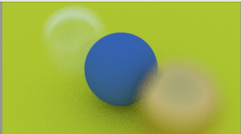

# multithreaded-ray-tracing
Implementation of a ray tracer in C++. This was made following Peter Shirley's blog at https://raytracing.github.io/books/RayTracingInOneWeekend.html.

## Running the application

After running, your result will be saved to output_image.ppm. 

Here's an example of a render might look like: 

Play around and see how the multi-threading performs under different setups!
